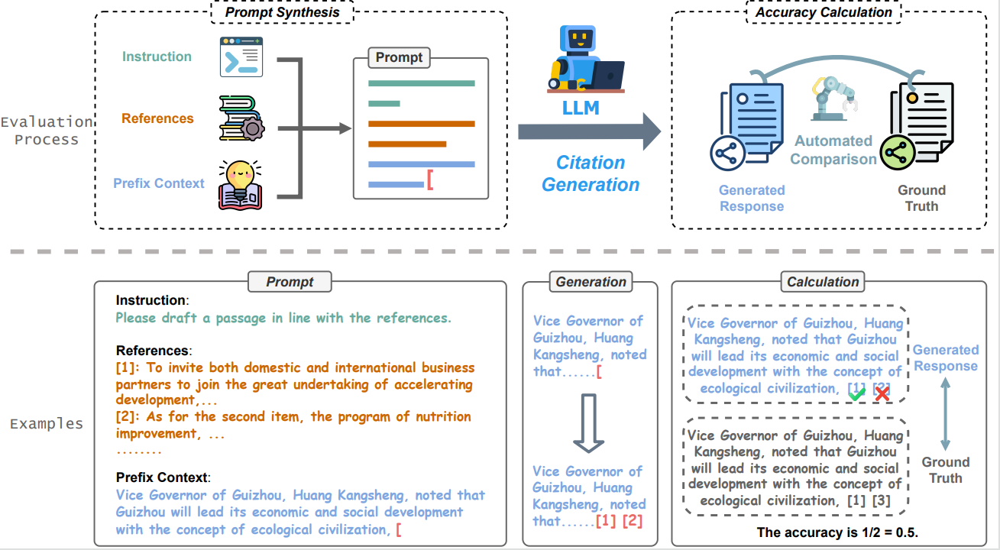

<h1 align="center">
    LMCBench: A Systematic Evaluation Framework for Assessing Citation Generation Capability of Large Language Models
</h1>

    
  <!--     &nbsp&nbsp
     -->
    &nbsp&nbsp
    

> Note: The Hugging Face account is registered with an anonymous email and is accessed via the web link.

We present LMCBench, an automated evaluation framework designed to reliably assess the citation capabilities of Large Language Models (LLMs). The framework utilizes a dataset containing over 2,400 query-response pairs across 20 diverse topics, with more than 29,000 citations. LMCBench ensures strict formatting requirements, allowing for automated comparison against ground truth citations.

We use LMCBench to evaluate the citation performance of 16 prominent LLMs, including GPT-4, Deepseek-v3, and GPT-4-turbo, which achieve the highest citation accuracy. The evaluation results closely align with human judgments. Our findings also show that different citation methods and topics can impact citation accuracy, offering valuable insights for improving citation generation. LMCBench provides a solid foundation for the development of more reliable content generation systems.

 

